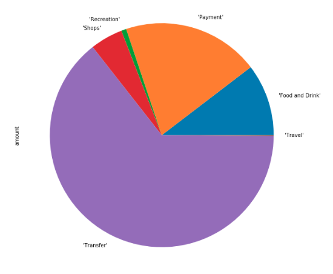
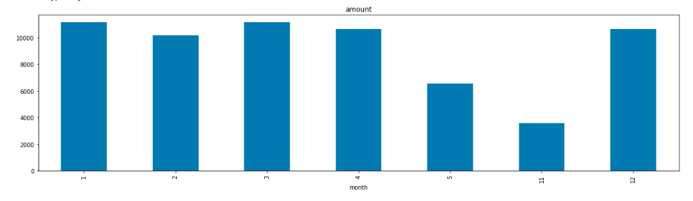
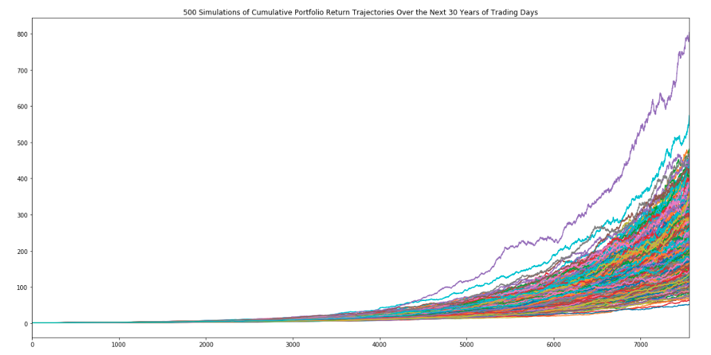
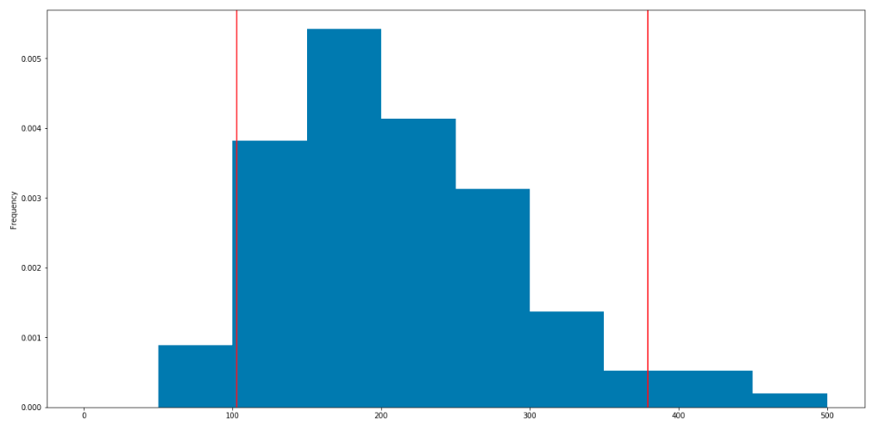

# Financial Report
* Date of Report: 5/26/20

**BUDGET ANLAYSIS** (*Plaid data as of 5/21/20*) 
* Details found in the adjoining "account_summary" file

#### Expenses by Category
* It should be noted that this looks at expenses the 6 months preceding 5/21/20 

#### Expenses by Month
* Looking at total expenses on a monthly basis reveals a fairly steady monthly outlay when considering both May (month 5) and November (month 11) only span a portion of those months 

* It should also be noted that these expenses are well above monthly projected income at $7,389 found later in this review

* Months in the below read as follows ("12" = Dec, "11" = Nov, etc)

***************
**RETIREMENT PROJECTIONS** (*Portfolio data spans 2019*) 
*  Details found in the adjoining "portfolio_planner" file

#### Projection Methodology and Cumulative Returns
* Utilizing 2019 data encompassing all 252 trading days, and 60/40 weights between SPDR ETF (ticker = SPY) and iShares aggregate bond fund (ticker = AGG) respectively, 30 year future retirement income was projected using a Monte Carlo simulation with total runs set at 500.

* The following is a look at the 30 year cumulative returns

#### Probability Distribution 

* The below chart is a view of the probability distribution 

***************
**SUMMARY ANALYSIS & NEXT STEPS** 
* A modest $20k initial investment at even the low end of potential outcomes puts Harold in a very comfortable position at a 4% withdrawal rate (~$95k estimated value at the 10% quartile) when compared to both his current and projected annual income (~$7.4k) 

* Projections are modelled off of a bullish 2019 and likely significantly overstate the 30 year cumulative return scenarios. Looking back a longer duration of time would be a necessary first step at assessing future returns